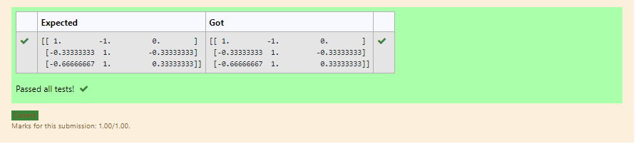

# INVERSE-OF-A-MATRIX
## Aim:
To write a python program to find the inverse of a matrix
## Equipment’s required:
1. 	Hardware – PCs
2. 	Anaconda – Python 3.7 Installation / Moodle-Code Runner
## Algorithm:
### Step1 : 
### Step 2: 
### Step 3: 
### Step 4: 

## Program:
~~~
#Program to find the inverse of a matrix.
#Developed by:Barath Kumar J
#RegisterNumber:21500088
import numpy as np
A=np.array([[2,1,1],[1,1,1],[1,-1,2]])
B=np.linalg.inv(A)
print(B)
~~~
## Output:

## Result:
Thus the inverse of given matrix is successfully solved using python program

